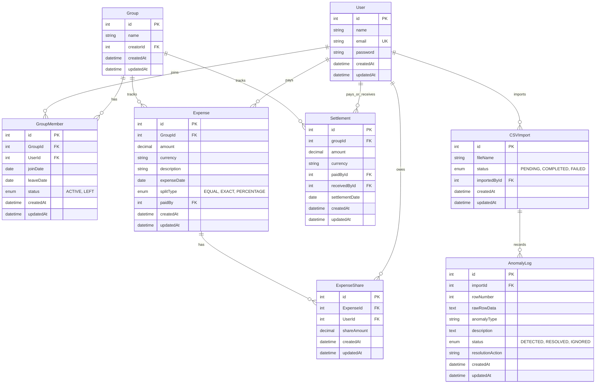

# SCOPE - Anomaly Log & Database Schema

## CSV Anomaly Log

Below is the log of the 12+ deliberate data anomalies detected in `expenses_export.csv` and how the application handles them.

| Row(s) | Description | Anomaly Detected | Resolution Policy |
| :--- | :--- | :--- | :--- |
| **5 & 6** | Dinner at Marina Bites | **Duplicate Entry**: Two rows represent the same payment of ₹3200 on Feb 8 by Dev. | The importer flags duplicates. One row is imported, the other is set to `skip`. |
| **7** | Electricity Feb | **Number Format**: Amount is formatted as `"1,200"` (with a comma). | The parser cleans quotes and commas (`1,200` becomes `1200`) before casting to decimal. |
| **9** | Movie night snacks | **Subset Split / Case Variation**: `priya` in lowercase; Meera is excluded. | The app handles case-insensitive user matching. The expense is split only among the active participants. |
| **10** | Cylinder refill | **Float Precision**: Amount is `899.995` (3 decimals). | The app rounds amounts to 2 decimal places (standard financial decimal). |
| **11** | Groceries DMart | **Name Variation**: Paid by `Priya S` but group member is `Priya`. | The app maps CSV name aliases (`Priya S` -> `Priya`) interactively using name mapping. |
| **13** | House cleaning supplies | **Missing Payer**: `paid_by` column is empty. | The app flags the error and prompts the user to select the payer (resolved to `Aisha` by default). |
| **14** | Rohan paid Aisha back | **Settlement Logged as Expense**: This is a direct peer-to-peer payment, not a split expense. | The app converts the row into a `Settlement` record instead of an `Expense` to keep ledger balances accurate. |
| **15** | Pizza Friday | **Invalid Percentages**: Split details `"Aisha 30%; Rohan 30%; Priya 30%; Meera 20%"` sum up to 110%. | The app alerts the user and scales the shares proportionally (or allows manual adjustment) to total 100%. |
| **16** | March rent | **Date Format Variation**: Date format changes from `YYYY-MM-DD` to `DD/MM/YYYY`. | The parser normalizes dates to the ISO standard `YYYY-MM-DD` (`01/03/2026` -> `2026-03-01`). |
| **20 & 21** | Goa villa / Beach lunch | **Foreign Currency**: Spent in USD ($540 and $84). | The app converts foreign currency to base INR currency using a user-specified exchange rate (default: 83.0). |
| **22** | Scooter rentals | **Share Split**: Split type is `share` with ratios (Aisha 1, Rohan 2, Priya 1, Dev 2). | The app computes total shares (6) and splits the expense proportionally: Rohan & Dev pay 2/6, Aisha & Priya pay 1/6. |
| **24 & 25** | Dinner at Thalassa | **Duplicate Conflict**: Two rows log Thalassa dinner (Aisha logs ₹2400, Rohan logs ₹2450). | The app flags the conflict. Based on notes, Aisha's row is skipped and Rohan's row is imported. |
| **26** | Parasailing refund | **Negative Expense / Refund**: Dev received a refund of -$30 USD. | The app imports negative amounts as refunds, reducing participants' balances and crediting the payer. |
| **28** | Groceries DMart | **Missing Currency**: Currency column is blank. | The app assumes the default base currency `INR`. |
| **31** | Dinner order Swiggy | **Zero Amount**: Expense amount is `0`. | The app records it as a zero-value expense (or allows the user to skip it). |
| **34** | Deep cleaning service | **Ambiguous Date / Ordering**: `04/05/2026` is out of order. | The app flags this for review. Formatted as 2026-05-04 or 2026-04-05 based on chronological context. |
| **36** | Groceries BigBasket | **Inactive Member**: Meera left in March, but is included in April 2nd expense. | The app excludes Meera from the split since she moved out before the expense date, dividing the share among remaining members. |
| **38** | Sam deposit share | **Security Deposit**: Direct transaction Sam -> Aisha. | The app converts this to a direct peer-to-peer settlement. |

---

## Database Schema

We use a Relational Database (MySQL) with the following schema:

